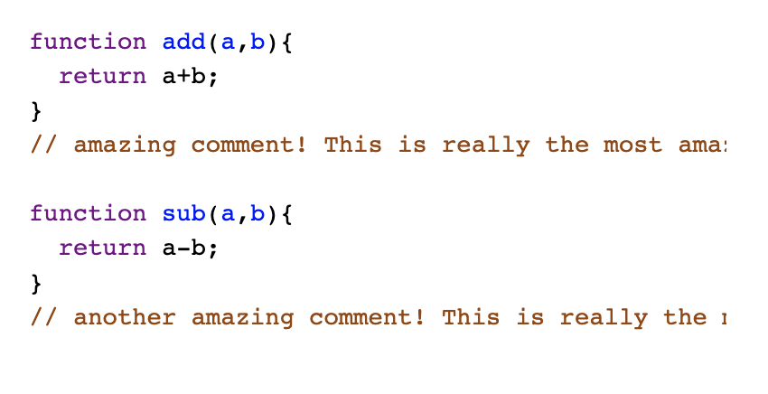
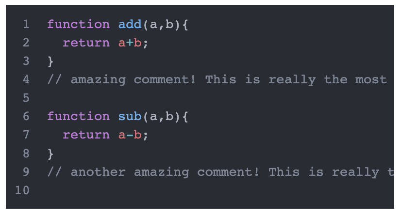

# CodeMirror-server-render (CodeMirror 6)
Renders CodeMirror 6 syntax highlighting as a string so you can use it at build time (ie: blog) or server-side.
Verified to work with latest CM6 `0.20` themes.

## Installation
`npm install codemirror-server-render`

## Usage
```js
renderString( "alert('hello')" ); // default theme, default language (js). Returns object
// -> {code: <div class="cm-editor "><div class="cm-scroller"><div class="cm-content"><div class="cm-line">alert(<span class="ͼe">'hello'</span>); </div></div></div></div>, css: {...} }
``` 

```js
 var result = renderString(code, oneDarkHighlightStyle, oneDarkTheme, {lineNumbers: true}); // themed for oneDark, and add lineNumbers
``` 

## Return value of `renderString()`
```js
{
  code, // a string of tokenized html, incuding editor wrapper html
  codeLinesOnly, // a string of tokenized html only, excluding the wrapper elements
  css: {
    baseEditorStyles, // string of base styles needed to use the editor. Loaded from './base-theme.css'
    highlightRules // an array of css rule strings based on the theme you are using (matches the classNames in 'code' prop above)
  }
}
```

## Examples
### Default styles, default language (JavaScript)


```js
import { renderString } from "codemirror-server-render";

 var code = `function add(a,b){
  return a+b;
} 
// amazing comment!`;

let result = renderString(code); 


  const html = `
    <head>
      <style>${result.css.baseEditorStyles}</style>
      <style>${result.css.highlightRules.join('\n')}</style>
    </head>

    <body>
      ${result.code}
  </body>
  `

```

### `One-dark` theme and `html` language. LineNumbers enabled


```js
import { htmlLanguage } from '@codemirror/lang-html';
import { oneDarkHighlightStyle, oneDarkTheme } from '@codemirror/theme-one-dark'
import { renderString } from "codemirror-server-render";

 var code = `<!DOCTYPE html>
  <body>
    <style>
     .red {color: red;}
    </style>
  </body>
`;

var result = renderString(code, oneDarkHighlightStyle, oneDarkTheme, {lineNumbers: true});

const html = `
  <head>
    <style>${result.css.baseEditorStyles}</style>
    <style>${result.css.highlightRules.join('\n')}</style>
  </head>

  <body>
    ${result.code}
</body>
`

```

## Customizing Editor CSS
Take a look at base-theme.css in this repo, and go from there.
